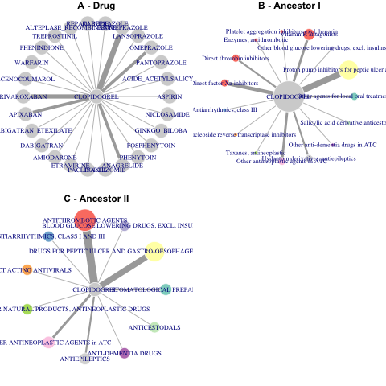

  
```{r setup, include=FALSE}
knitr::opts_chunk$set(echo = TRUE)
```

## Context

In the era of massive open-data access and big data in general, pharmaco-epidemiology and public health sciences are in need for bioinformatics tools. Researchers can now query large medical information systems such as medico-administrative databases and claim databases. Although those information systems are often well strutured, their contents are highly codified with several medical terminologies and ontologies, which might be difficult to analyze by non-expert. Pharmaco-epidemiologists and public health scientists thus need batch translation of diverse medical codes like diagnostic codes (based on ICD9 or ICD10), medical procedures or drugs codes (in ATC nomenclature). In addition to the translation of those codes, their annotation can help making the most of medico-administrative and claim databases analysis by public health researchers. For instance, in a patient care trajectory it might help identifying  critical drug interactions that might impair the patient safety. It might also be used to predict evitable hospitalisation.

Using ontologies in R has proven to be efficient and useful, notably in *omic fields of research. For example, many genomes (including the Human genome) are available for downlaod through the BioConductor repository. Those genomes are annotated and statistical analyses of enrichment of standardised terms (commun or closely related) within part of living organisms have help discovering new or impaired functions.

Today the Linked Open Data and the Semantic Web provide the technical solutions for the integration of distributed data, their interrogation and their interpretation.

sentence on RDF and SPARL

These technologies allow reasoning through knowledge, especially in the form of ontologies, classifications or medical thesauri. Essential knowledge in pharmacoepidemiology, drug interactions, indications and contraindications has thus been taken into account in clinical data analyzes [@pathak13]. However, while works like the Drug Indication Database (DID) and Drug Interaction Knowledge Base (DIKB) have pooled different sources of medical knowledge from the Web of Data [@ayvaz15; @sharp17], the use and merging of knowledge is still well-to-do with the multitude of medical classifications and sources of knowledge.

We propose a tool to integrate ontologies programmatically in the R environment. The queryMed package provides functions and algorithms to query the different sources of medical knowledge representations from the Web of data and to link them to the main medical classifications, for the enrichment of the analysis of clinical and clinical data.


## Material and Methods 

Sources

The queryMed package propose to access and link several data sources through semantic web tools. 
BIOPORTAL [@whetzel11], the international repository of biomedical ontologies, that allows ... BIOPORTAL is through its SPARQL endpoints [@salvadores12; @salvadores13]

Drug Interaction Knowledge Base (DIKB) [@sharp17]

Drug Indication Database (DID) [@ayvaz15]
 
NDFRT

ANSM

Methods

 SPARQL
 REST API
 R object


## Applications

Using queryMed, the platelet antiaggregant CLOPIDOGREL presents 26 known interactions with other drugs according to DIKB (Fig1A). Some interactions are reported by more than one source (represented by the thinkness of the edge). Some drugs belong to the same ATC family (represented by the vertex color). When considering more general classes of the ATC nomenclature, the interactions concern 15 and 11 classes, respectively (Fig1B, Fig1C). Again some classes are characterized by a high number of interactions (size of the vertex) and sources (thinkness of the edge), notably the anti-thrombotic and gastro-esophageal family. In the context of pharmacovigilance, one could then make assumptions about the value of expanding the study of interactions between clopidogrel and the 26 known drugs to those between clopidogrel and the families they belong to. 

```{r load library, eval=F}
library(queryMed)
library(data.table)
```

```{r load data, eval=F}
DIKB <- get_DIKB(path="/tmp",mapping="ATC")
DIKB$object <- toupper(DIKB$object)
DIKB$precipitant <- toupper(DIKB$precipitant)
clop = DIKB[DIKB$object=="CLOPIDOGREL",]
clop = as.data.table(clop)

clop2 <- clop 
clop2$atc2   <- substr(clop$atc2, 24, 30)
clop2$parent  <- substr(clop2$atc2,1, 5)
clop2$root  <- substr(clop2$atc2,1, 4)
clop2<- clop2[!is.na(clop2$atc2),]

statclop = clop2[, .N,by=list(precipitant, atc2, root)]
```


```{r igraph, eval=F}
library(RColorBrewer)
mypalette<-brewer.pal(11,"Set3")
mypalette = cbind(mypalette, "root"=unique(statclop$root))
statclop<- merge(statclop, mypalette, by="root")

library(igraph)
g1 <- graph_from_edgelist(as.matrix(cbind("CLOPIDOGREL", statclop[,2])), directed=F) 
statclop$N[statclop$N == 1 ] <- 0
E(g1)$weight <- statclop$N         
E(g1)$width <- 1+E(g1)$weight*2
V(g1)$size <- 20
V(g1)$frame.color <- "white"
V(g1)$color <-  c("lightgrey", statclop$mypalette)
l1 <- layout_as_star(g1)
plot(g1, edge.color="grey", layout=l1)

# ancestor I
res1<-c()
res2<-c()
for (i in 1:nrow(clop2)){
temp<- get_ancestors(clop2$atc2[i], ontology="ATC", api_key="e6f2d058-f206-4ac7-a8f9-60b84c9e57dc")
res1[i] <- temp[1,2]
res2[i] <- temp[2,2]
}
clop2$anc1 <- res1 
clop2$anc2 <- res2 


statclop1 = clop2[, .N, by=list(anc1,root, parent)]
nbdrugclop1 = clop2[, length(unique(precipitant)), by=parent]

statclop2 = clop2[, .N, by=list(anc2,root)]
nbdrugclop2 = clop2[, .N, by=root]

colnames(nbdrugclop1) = c("parent","nbdrug")
colnames(nbdrugclop2) = c("root","nbdrug")
statclop1 = merge(statclop1, nbdrugclop1, by="parent")
statclop2 = merge(statclop2, nbdrugclop2, by="root")

statclop1<- merge(statclop1, mypalette, by="root")
statclop2<- merge(statclop2, mypalette, by="root")

g2 <- graph_from_edgelist(as.matrix(cbind("CLOPIDOGREL", statclop1[,3])), directed=F ) 
statclop1$N[statclop1$N == 1 ] <- 0
E(g2)$weight <- statclop1$N         
E(g2)$width <- 1+E(g2)$weight
V(g2)$size <- c(8, statclop1$nbdrug)*6
V(g2)$vertex.label.cex <-2
V(g2)$frame.color <- "white"
V(g2)$color <-  c("lightgrey", statclop1$mypalette)
#V(g2)$color <- "orange"
l2 <- layout_as_star(g2)
plot(g2, layout=l2)

# ancestor II
g3 <- graph_from_edgelist(as.matrix(cbind("CLOPIDOGREL", statclop2[,2])), directed=F) 
statclop2$N[statclop2$N == 1 ] <- 0
E(g3)$weight <- statclop2$N         
E(g3)$width <- 1+E(g3)$weight
w= c(15,20,15,20, rep(15,7))
V(g3)$size <- c(20, statclop2$nbdrug+w)
V(g3)$vertex.label.cex <-0.5
V(g3)$frame.color <- "white"
V(g3)$color <-  c("lightgrey", statclop2$mypalette)
l3 <- layout_as_star(g3)
plot(g3, vertex.label.cex= 0.8, layout=l3)

png("queryMed/vignettes/Figure1.png")
par(mfrow=c(2,2), mar=c(1,1,1,1)) 
plot(g1, vertex.label.cex= 0.8, layout=l1*0.6, main="A - Drug")
plot(g2, vertex.label.cex= 0.8, layout=l2*0.6, main="B - Ancestor I")
plot(g3, vertex.label.cex= 0.8, layout=l3*0.6, main="C - Ancestor II")
dev.off()

```



```{r sessionInfo, eval=F}
sessionInfo()
```


## References

